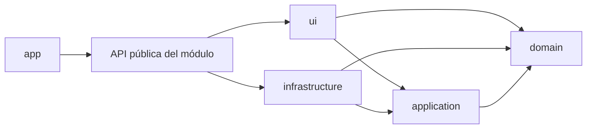

# Arquitectura frontend

## Trazabilidad
- Constitución: [`constitution.md`](constitution.md).
- Especificación: [`spec.md`](specs/001-definir-arquitectura/spec.md).
- Plan: [`plan.md`](specs/001-definir-arquitectura/plan.md).
- Tareas: [`task.md`](specs/001-definir-arquitectura/task.md).
- Decisiones: [`ADR-001`](adr/001-arquitectura-modular-por-dominio.md) y [`ADR-002`](adr/002-migracion-de-vite-a-nextjs.md).
- Migración a Next.js: [`spec 002`](specs/002-migrationProject/spec.md).

## Estructura
- `src/app/[lang]/`: composición con Next.js App Router; layout y página por idioma.
- `src/components/landing/`: secciones visuales de la landing.
- `src/components/ui/`, `src/hooks/`, `src/lib/`: componentes shadcn/ui y utilidades técnicas.
- `src/modules`: capacidades del negocio independientes.
- `domain`: entidades, reglas e invariantes sin React.
- `application`: casos de uso y contratos de entrada o salida.
- `infrastructure`: validación y adaptación de fuentes externas.
- `ui`: componentes, eventos y estados de presentación.
- `src/shared`: recursos técnicos usados por más de un módulo.

## Dependencias

Las dependencias apuntan hacia aplicación y dominio. `pnpm architecture` bloquea ciclos, acceso de `src/app/` y `src/components/` a capas internas y dependencias desde capas internas hacia capas externas.

## Convenciones
- Un módulo usa un nombre de capacidad de negocio en `kebab-case`.
- Cada módulo expone únicamente su `index.ts` a consumidores externos.
- Los archivos de componentes y clases usan `PascalCase`; funciones y casos de uso, `camelCase`.
- Los alias `@/*` (`./src/*`), `@modules` y `@shared` se reservan para cruces entre espacios.
- Las importaciones internas de un módulo son relativas.

## Responsabilidades
| Capa | Contiene | No contiene |
| --- | --- | --- |
| Dominio | Reglas, invariantes y tipos del negocio | React, red o persistencia |
| Aplicación | Casos de uso y contratos | Componentes o adaptadores concretos |
| Infraestructura | Adaptadores y validación externa | Reglas de presentación |
| Interfaz | Componentes y estados visuales | Reglas de negocio |
| App y componentes de página | Composición, rutas y secciones visuales | Reglas de negocio o detalles internos de módulos |

## Datos y errores
- Cada flujo mantiene una sola fuente de verdad.
- Infraestructura valida tipos externos y dominio protege invariantes.
- La interfaz representa carga, éxito, vacío y error de forma explícita.
- Los errores internos no se muestran directamente a las personas usuarias.

## Pruebas
- Dominio: pruebas unitarias puras.
- Aplicación: contratos sustituidos por dobles.
- Infraestructura: validación y transformación de entradas.
- Interfaz: comportamiento observable con React Testing Library.
- Página principal: `src/app/[lang]/page.test.tsx` verifica por idioma las secciones, el `<h1>`, WhatsApp, JSON-LD e hidratación.
- Arquitectura: reglas de dependencias con dependency-cruiser.

## Verificación
- `pnpm check`: formato, lint y tipos.
- `pnpm test`: pruebas unitarias y de componentes.
- `pnpm architecture`: fronteras entre capas.
- `pnpm validate`: validación completa y build de producción de Next.js.
